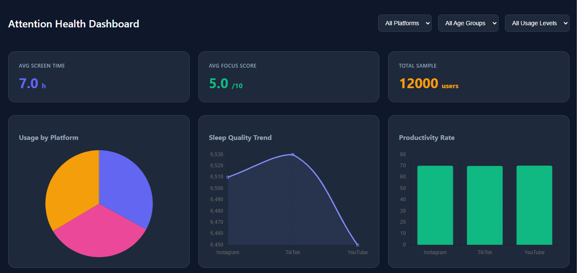

# Attention Health Dashboard

An interactive data visualization platform developed by Daniel Bonilla to analyze the correlation between digital consumption habits and mental health indicators such as focus, sleep quality, and stress levels. Built as part of a technical challenge focused on full-stack development and data visualization.

## Project Preview

## Key Features
- Multi-Dimensional Data Analysis: Features 5 distinct chart types including Pie, Line, Bar, and Scatter plots to cover various KPIs.
- Advanced Correlation Logic: Includes a Scatter Plot with an integrated Linear Regression Trendline to visualize how screen time impacts attention spans.
- Dynamic Real-time Filtering: Users can toggle between platforms (Instagram, TikTok, YouTube) with instant UI updates via React hooks.
- Automated Insights Module: A custom-built carousel component that calculates and cycles through key statistical takeaways every 5 seconds.
- Modular Component Architecture: Clean and organized React structure using reusable components for Cards, Charts, and KPIs.

## Tech Stack
- Frontend: React.js (Hooks, Axios, Chart.js)
- Backend: Django REST Framework (Python)
- Database: SQLite (Dev) / PostgreSQL (Prod)
- UI/UX: Responsive Dark Mode Grid Layout

## Installation and Setup

1. Clone the repository:
git clone https://github.com/ddabnll/attention-health-dashboard.git

2. Backend Configuration:
cd backend
pip install -r requirements.txt
python manage.py migrate
python manage.py runserver

3. Frontend Configuration:
cd frontend
npm install
npm start

## License
This project is under the MIT License.